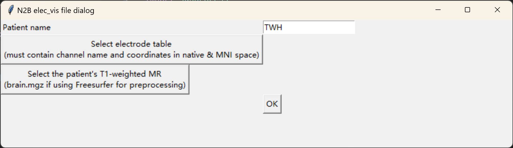
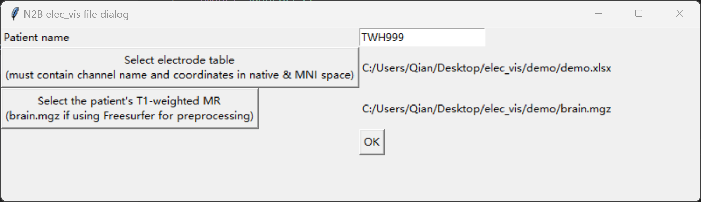

# elec_vis
Multiplanar visualization of electrode locations in native and MNI spaces using MRIcroGL.

# Dependencies

## Python

Required packages:
- Pandas https://pandas.pydata.org/docs/getting_started/install.html
- PIL - Python Imaging Library https://pillow.readthedocs.io/en/stable/installation.html

## MRIcroGL (OS-specific)
NITRC release at https://www.nitrc.org/projects/mricrogl

GitHub release at https://github.com/rordenlab/MRIcroGL. Download links:
  - Linux https://github.com/rordenlab/MRIcroGL/releases/latest/download/MRIcroGL_linux.zip
  - MacOS https://github.com/rordenlab/MRIcroGL/releases/latest/download/MRIcroGL_macOS.dmg
  - Windows https://github.com/rordenlab/MRIcroGL/releases/latest/download/MRIcroGL_windows.zip

# How to use
- Install the [dependencies](#Dependencies)
- In [monitor.json](monitor.json), enter your monitor's width and height (in pixel) and MRIcroGL directory. Knowledge of screen size allows MRIcroGL to choose a window size appropriate for visualization
- Prepare an electrode table that has the following columns (output of reconstruction)
  - `channel` (e.g. LAMu)
  - `native_x` (in mm, so below)
  - `native_y`
  - `native_z`
  - `MNI_x`
  - `MNI_y`
  - `MNI_z`
- Patient's MRI scan that was used for reconstruction
  - Usually `brain.mgz` if using Freesurfer for preprocessing
- Run [elec_vis.py](elec_vis.py)
  - A GUI (created by tkinter) will pop up 
  - Enter patient's ID in the entry box (prefix "TWH" is automatically given but not necessary)
  - Select the electrode table and the patient's T1-weighted scan using corresponding buttons 
  - Click OK once selection is complete (will yield error if file selection was not complete/successful) 
  - Lie down and watch MRIcroGL do the job!
  - Check the results in the directory of electrode table, in a new folder named `{patient_name} + elec_vis`. It has three subfolders:
    - `native`: electrode locations in the patient's native brain space
    - `MNI`: electrode locations in MNI space without overlay of atlas
    - `MNI_AAL`: electrode locations in MNI space with AAL atlas overlaid
  
# Disclaimer
Visualization results are dependent on outputs of anatomical reconstruction (e.g., https://doi.org/10.1038/s41596-018-0009-6). For research purposes only.

# Contact
Qian Chu at qian.chu@mail.utoronto.ca or qian.chu@ae.mpg.de
